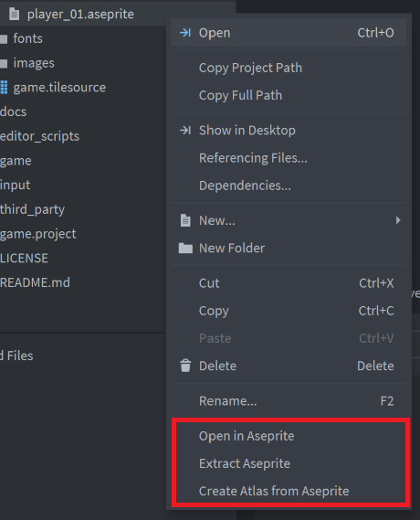
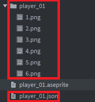
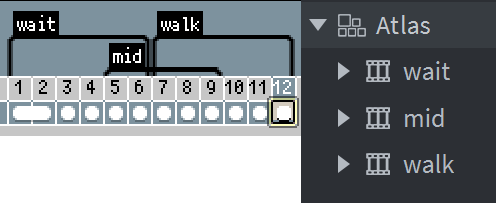

# Defold Aseprite Scripts (DAS)

DAS is to add functionality to Defold to work with Aseprite.

**Aseprite is required to use DAS.**

# Installation

1. Add Aseprite to PATH.

Add Aseprite installation directory to PATH.
If you have installed Aseprite from Steam, [here](https://community.aseprite.org/t/find-aseprite-executable-when-aseprite-is-installed-from-steam/1268) is a good page to start.

2. Add DAS to your project.

You can use DAS in your own project by adding this project as a [Defold library dependency](http://www.defold.com/manuals/libraries/). Open your game.project file and in the dependencies field under project add:

https://github.com/masakazu-k/defold-aseprite-scripts/archive/main.zip

Or point to the ZIP file of a [specific release](https://github.com/masakazu-k/defold-aseprite-scripts/releases).

# Usage

Right click on Aseprite file(.ase or .aseprite) in Assets View and shown the following menu.



|||
|---|---|
|Open in Aseprite|Open selected file in Aseprite|
|Extract Aseprite|Extract the list of png files and meta information of all frames from the selected file|
|Create Atlas from Aseprite|Create an Atlas from a list of png files and meta information|

When "Extract Aseprite" is run, ```[filename].json``` and ```[filename]/[frame].png``` are created in the same directory.These files will be needed later, so do not delete them until you run "Create Atlas from Aseprite".



When "Create Atlas from Aseprite" is run, [filename].atlas is created.
Will fail if ``[filename].json`` is missing.

# About animations imported from Aseprite

Tags are imported as animation group.



Animations will be set to the following values from tags.

|||
|---|---|
|Id| Tag's name |
|Fps|60 fixed|
|Flip Horizontal|false fixed|
|Flip Vertical|false fixed|
|Playbook|Tag's direction (Set all as "Loop")|

# Third-Party

This project uses [json.lua](https://github.com/rxi/json.lua), because "json" is nil in editor_script.

---